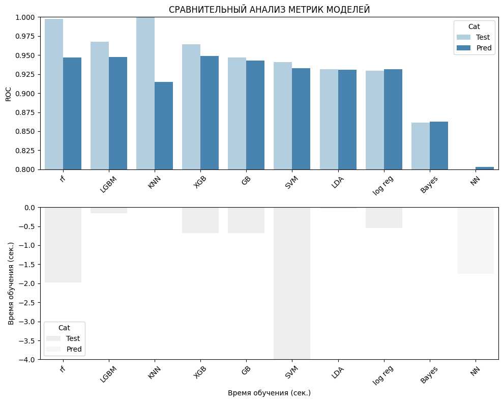

# **Исследование банковских данных для предсказания депозита клиентов**

Исследование данных банка с целью предсказания, откроют ли клиенты депозит, ключевые этапы:

1. [**Future Engineering**](#feature-engineering) : инжиниринг переменных (комбинирование признаков для улучшения понимание моделью данных), формирование и проверка статистических гипотез
   
2. [**Exploratory Data Analysis**](#eda) : анализ данных, кластеризация, выявление аномалий, заполнение пропусков, оцифровка номинальных переменных, отбор параметров модели, ребалансировка классов.

3. [**Агрегатор моделей**](#metrics-aggregation) : агрегатор моделей, оценка моделей регрессии и классификации, сравнительный анализ, эффективная визуализация данных и объяснение выводов результатов работы.

## Структура репозитория
- `01_preprocessing.pynb` - предобработка, анализ пропусков, выбросов, баланса выборки, обработка категориальных признаков и корреляционный анализ.
- `02_model.pynb` - построение и обучение различных моделей машинного обучения, включая сравнение метрик моделей и поиск оптимальных параметров.
- `data` - папка промежуточных и исходных данных
- `README.md` - общее описание проекта

<div style="display: flex;">
    
    
    
    
</div>

## Используемые библиотеки
- [**pandas**](https://pandas.pydata.org/): работа с табличными данными.
- [**numpy**](https://numpy.org/): операции с многомерными массивами.
- [**sklearn**](https://scikit-learn.org/stable/): алгоритмы машинного обучения, предобработка данных, оценка моделей.
- [**matplotlib**](https://matplotlib.org/): визуализация данных.
- [**seaborn**](https://seaborn.pydata.org/): статистические графики.
- [**xgboost**](https://xgboost.readthedocs.io/en/latest/): градиентный бустинг для классификации и регрессии.
- [**lightgbm**](https://lightgbm.readthedocs.io/en/latest/): оптимизированный градиентный бустинг для классификации и регрессии.

## Запуск проекта
- Клонируйте репозиторий и установите библиотеки:
```bash
git clone https://github.com/AlexanderGithubProfile/BANK_SCORING.git
pip install -r requirements.txt
```
- Запустите Jupyter Notebook с кодом исследования.


