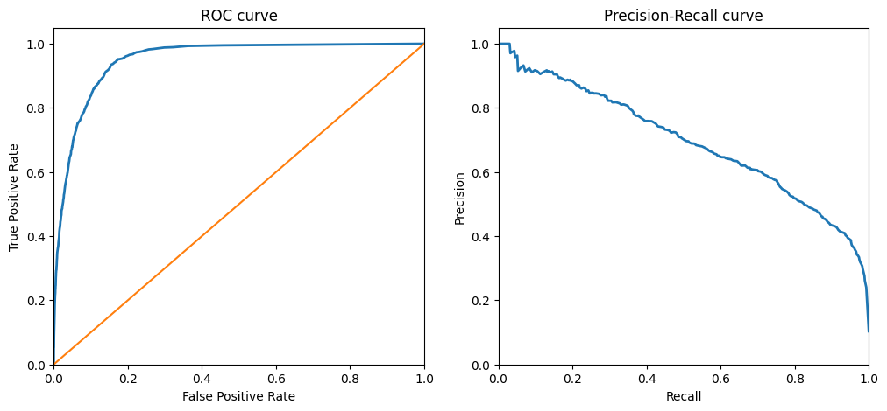

# **Руководство. Исследование банковских данных для предсказания депозита клиентов**

## **Описание проекта**
Данный проект основан на исследовании данных банка с целью предсказания того, откроют ли клиенты депозит, включающий в себя :

1. [**Exploratory Data Analysis**](#eda) : Поиск и исправление ошибок, работа с пропусками данных, оцифровка номинальных переменных, отбор параметров модели, ребалансировка классов.
2. [**Future Engineering**](#feature-engineering) : Инженерия признаков то есть создание гипотез и комбинаций признаков для улучшения модели.
   
3. [**Агрегированный анализ метрик по всем моделям**](#metrics-aggregation) : Сравнительный анализ различных моделей с оценкой важности признаков лучших моделей.

## Установка
1. Клонируйте репозиторий:
```bash
git clone https://github.com/AlexanderGithubProfile/BANK_SCORING.git
```
## Структура репозитория
1. `01_preprocessing.pynb`В этой части проекта предобработка данных, включая анализ пропусков, выбросов, баланса выборки, а также обработка категориальных признаков и корреляционный анализ.
2. `02_model.pynb`В этой части проекта выполняется построение и обучение различных моделей машинного обучения для предсказания депозита клиентов. Включает в себя разделение выборки на тренировочную и тестовую, обучение моделей, сравнение метрик и поиск оптимальных параметров.
3. `data`: В этой папке хранится исходный файл с данными `banking.csv` и экспорт промежуточных данных для обучения моделей `export.csv` в папке export.
3. `README.md`: Этот файл содержит общее описание проекта и инструкции по его запуску.

<div style="display: flex;">
    
    
    
    
</div>

## Используемые библиотеки
- [**pandas**](https://pandas.pydata.org/): Библиотека для работы с данными, предоставляющая удобные инструменты для обработки и анализа табличных данных.
- [**numpy**](https://numpy.org/): Библиотека для работы с многомерными массивами данных и математическими операциями над ними.
- [**sklearn**](https://scikit-learn.org/stable/): Библиотека машинного обучения, предоставляющая реализации множества алгоритмов обучения с учителем и без учителя, а также инструменты для предобработки данных и оценки моделей.
- [**matplotlib**](https://matplotlib.org/): Библиотека для создания различных типов графиков и визуализации данных в Python.
- [**seaborn**](https://seaborn.pydata.org/): Библиотека для визуализации данных на основе matplotlib, предоставляющая более высокоуровневый интерфейс для создания статистических графиков.
- [**xgboost**](https://xgboost.readthedocs.io/en/latest/): Библиотека для градиентного бустинга, оптимизированная для скорости и производительности, использующаяся в задачах классификации и регрессии.
- [**lightgbm**](https://lightgbm.readthedocs.io/en/latest/): Библиотека для градиентного бустинга, также оптимизированная для скорости и производительности, часто используемая в задачах классификации и регрессии.

## Запуск проекта
Чтобы запустить проект, выполните следующие шаги:
1. Склонируйте репозиторий на свой компьютер.
2. Установите необходимые библиотеки, указанные в файле `requirements.txt`.
3. Запустите файлы Jupyter Notebook с кодом исследования.


